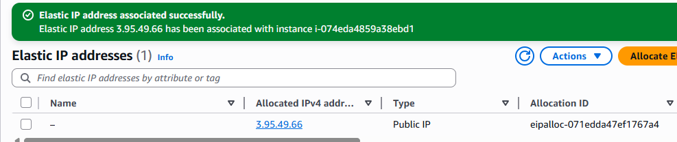
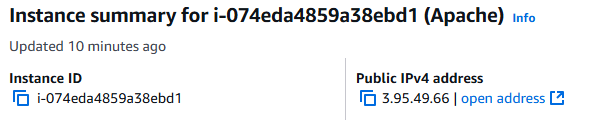
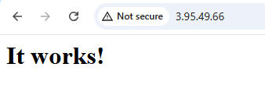
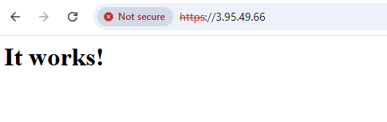

# Lab06-AREP

## Work during class

Se evidencia que se puso la IP elastica a la EC2 de Apache para poder hacer las certificaciones

Se prueba que ya es accesible por http despues de instalar apache en el EC2

Se añadio el certificado para que funcione por https.

