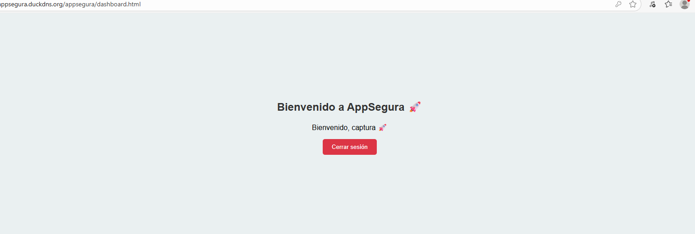

# Lab06-AREP

## Resumen del proyecto
AppSegura es una aplicación web que permite a los usuarios registrarse, iniciar sesión y acceder a un panel seguro. La aplicación protege la información del usuario mediante **autenticación con username y contraseña** y comunicación segura a través de **HTTPS**.

El proyecto incluye un **frontend simple en HTML/JS**, un **backend desarrollado con Spring Boot** y una **base de datos MariaDB** que almacena la información de usuarios. Es ideal para aprender conceptos de seguridad web básica y arquitectura cliente-servidor.

## Arquitectura usada
La arquitectura del proyecto sigue un **modelo cliente-servidor** con tres capas principales:

### 1. Frontend (Cliente)
- Desarrollado en HTML y JavaScript.
- Se comunica con el backend vía **API REST**.
- Maneja el registro, login y redirección al dashboard.

### 2. Backend (Servidor)
- Implementado con **Spring Boot**.
- Expone endpoints REST (`/auth/register` y `/auth/login`) para el registro y autenticación.
- Usa **BCrypt** para almacenar las contraseñas de forma segura.
- Permite la comunicación con múltiples clientes a través de JSON.

### 3. Base de datos
- **MariaDB** ejecutándose en otra instancia EC2.
- Almacena la información de usuarios (username y password).
- El backend se conecta a la base de datos para validar logins y registrar usuarios.

## Flujo de la aplicación
1. El usuario se registra o inicia sesión desde el frontend.
2. El frontend hace llamadas HTTP al backend.
3. El backend valida la información y retorna éxito o error.
4. Una vez autenticado, el usuario accede al dashboard seguro.

## Seguridad

AppSegura implementa varias capas de seguridad para proteger la información del usuario y la comunicación entre cliente y servidor:

- **Autenticación segura:**  
  Los usuarios deben proporcionar un nombre de usuario y contraseña para acceder a la aplicación. El backend valida las credenciales y permite el acceso únicamente a usuarios registrados.

- **Encriptación de contraseñas:**  
  Las contraseñas se procesan mediante un algoritmo de hashing seguro (BCrypt) antes de ser comparadas durante el inicio de sesión, evitando el uso de contraseñas en texto plano.

- **Comunicación segura (HTTPS):**  
  Toda la comunicación entre el navegador y el servidor web se realiza mediante HTTPS, lo que asegura que los datos transmitidos estén encriptados y protegidos contra interceptaciones.

- **Control de acceso:**  
  Las páginas internas, como el dashboard, solo son accesibles después de la autenticación correcta. Si un usuario no autorizado intenta acceder, se le redirige al login.

- **CORS seguro:**  
  El backend permite únicamente solicitudes desde los orígenes configurados, evitando que sitios externos realicen peticiones no autorizadas.

## Muestras desarrollo (Certificados y dominios)

### IP Elastica

Se evidencia que se puso la IP elastica a la EC2 de Apache para poder hacer las certificaciones

### Funcionamiento Apache http

Se prueba que ya es accesible por http despues de instalar apache en el EC2

### Certificado https

Se añadio el certificado para que funcione por https.

### Dominios

Se crearon los dominios correspondientes tanto para el back como para el front.

## Ejemplo funcionamiento Correcto

Se probara el flujo y el funcionamiento del trabajo realizado, para eso primero se creara una cuenta

Se evidencia que la cuenta fue creada satisfactoriamente

Se revisa en la base de datos de MariaDB para verificar que si se haya guardado y si este encriptada, como se evidencia todo funciona de manera correcta.

Ahora se hace el login con la cuenta que acabamos de crear para ver si permite realizarlo.

Por último vemos como el funcionamiento de todo esta bien y se pudo avanzar a la página principal.

## Video

[Video Demostración despliegue y funcionamiento](https://pruebacorreoescuelaingeduco-my.sharepoint.com/:v:/g/personal/santiago_cordoba-d_mail_escuelaing_edu_co/EefiOz-YeBtOmNCS542rRSMBkTGsOcr9ZLcmSBT1xC8rtA?e=GBaUzZ&nav=eyJyZWZlcnJhbEluZm8iOnsicmVmZXJyYWxBcHAiOiJTdHJlYW1XZWJBcHAiLCJyZWZlcnJhbFZpZXciOiJTaGFyZURpYWxvZy1MaW5rIiwicmVmZXJyYWxBcHBQbGF0Zm9ybSI6IldlYiIsInJlZmVycmFsTW9kZSI6InZpZXcifX0%3D)

## Built With

* [Java](https://www.java.com/es) - Lenguaje para el backend
* [Maven](https://maven.apache.org/) - Manejo de Dependencias
* [Spring initializr](https://start.spring.io) - Crear el proyecto de Spring con dependencias
* [AWS](https://aws.amazon.com/es/free/?trk=90bc4346-f6a5-4430-b543-83e255b54666&sc_channel=ps&ef_id=CjwKCAjwobnGBhBNEiwAu2mpFGmYC_nqnz9GF7a-i-QbT3aLWvsfkpjY0XLhTyglvGtvzrK5R8fM7BoC29AQAvD_BwE:G:s&s_kwcid=AL!4422!3!647999754693!e!!g!!aws!19685286946!149715822407&gad_campaignid=19685286946&gclid=CjwKCAjwobnGBhBNEiwAu2mpFGmYC_nqnz9GF7a-i-QbT3aLWvsfkpjY0XLhTyglvGtvzrK5R8fM7BoC29AQAvD_BwE) - Plataforma de servicios de nube
* [Duckdns](https://www.duckdns.org/domains) - Dominios gratuitos

## Authors

* **Santiago Córdoba Dueñas**  - [Santiago Córdoba](https://github.com/Santiago-Cordoba)

## Acknowledgments

* Aprendizaje acerca del funcionamiento de un EC2 en AWS
* Refuerzo del uso de bases de datos como persistencia en API´s
* Aprendizaje de instalacion de una base de datos en una instancia EC2